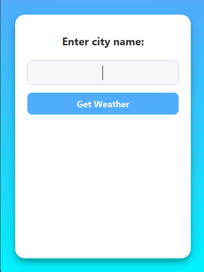

# Weather App
 
## About:
 
Simple weather app made with python that takes weather data of requested city from open weather app and displays it.
 
## Screenshot
 

 
## Technical Details
 
### Key Features:
 
**City Search:**
 
- Text input for entering any city name
**Weather Display:**
- Current temperature (°C)
- Weather description (e.g. light rain, clear sky)
- Weather emoji representing current conditions
**Error Handling:**
 
- Messages for invalid cities, bad API responses, and connection issues
### Platform:
 
Language: Python
 
GUI Framework: PyQt5
 
API: OpenWeatherMap
 
